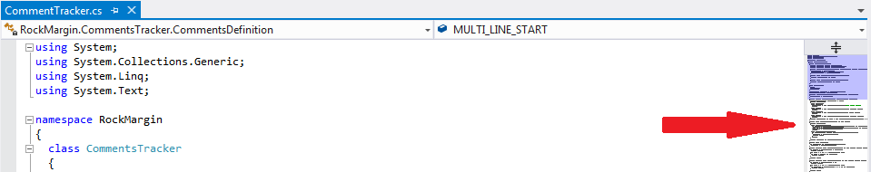
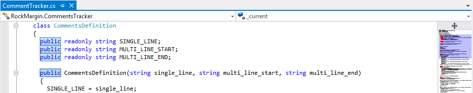
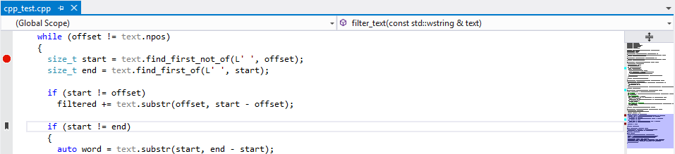
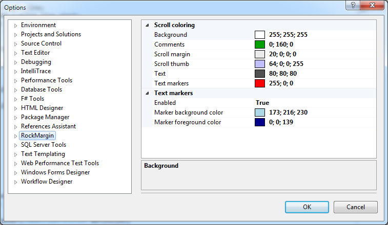

# RockMargin

In VS 2005/2008 days I've found the tool that makes code navigation easy and fast. It was named `RockScroll`. Year by year I used this tool every day and become addicted to it. But then came era of VS2010 and my world crashed into pieces because RockScroll was never ported to new versions of Visual Studio. I tried loads of possible replacemens but haven't found any that could make me as happy as I was in the days of RockScroll. So as usually happens with programmers I decided to write my own.

---

See the [change log](CHANGELOG.md) for changes history.

---

##### Vertical scrollbar

This extension replaces Visual Studio vertical scrollbar with current text document overview that works as scrollbar at the same time. And there is the magic happens: on source files with up to few thousands of lines its really easy to navigate through your code using thumbnail view of the file.

##### Words highlighting

Double clicking on any word in the text highlight it both in text editor and in scrollbar. Using this feature you can easely track all occurences of some word in your file without using text search.

Right clicking on scrollbar removes highlighting.

##### Boormarks & Breakpoints

Also you can see all breakpoints and bookmarks in current source file - they are displayed on the left side of scrollbar.

##### Comments highlighting

I tried to make full syntax highlighting in thumbnail view of text but it appeared to be quite complex thing to do both algorithmically and performance wise. Also with some early prototypes of syntax highlighting I've found that on some files scrollbar becomes as colorful as Rio carnaval at night which is not very helpfull when you writing your code. So I decided to leave only comments coloring like RockScroll had. Both single line and miltiline comments supported.

At the moment comments coloring supported only for the next languages:
- C/C++
- C#
- VisualBasic
- LUA
- XML

Choice of languages is quite presonal - its set of languages I usually use. If some of you knows language-agnostic way to track comments without spending too much CPU cycles I would be glad to read your proposals and implement language-independent comments traking.

##### Outlining support

Its a Visual Studio feature that RockScroll never supported and this fact distracted many programmers from using it. RockMargin supports it natively.

##### Split windows support

Another one feature RockScroll had problems with. Its supported out of the box too.

##### Customizable options

To make RockMargin play nicely with all possible Visual Studio color themes all colors are fully customizable. Also you can disable words highlighting feature if you prefer similar one from some other extension you use (like [VisualAssist]) or Visual Studio built-in.

[VisualAssist]: http://www.wholetomato.com

##### Performance/memory optimized

One of my primary goals was consuming as low resources as possible to not affect your Visual Studio experience in any way.

As result this extension works almost instantly on nowadays PC's with files up to 10000 lines of code. With million lines of code you can experience lowered redraw speeds (about 2-3 seconds) but Visual Studio performance will not be affected by this extension even with such huge files because actual rendering and file parsing done in worker thread.

---

##### Works On My Machine Disclaimer
> This is released with exactly zero warranty or support. If it deletes files or kills your family pet, you have been warned. It might work great, and it might not. It hasn't been tested against the myriad of other VS Add-Ins, but it works well on my machine.

---

**P.S:** I’d like to say thanks to [Scott Hanselman] who released RockScroll - great tool that completely changed the way I’m writing code in Visual Studio.

[Scott Hanselman]: http://www.hanselman.com/blog/